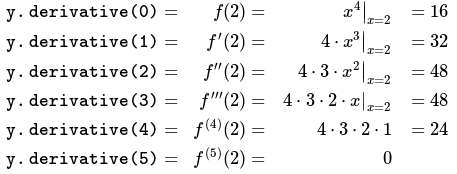

# Autodiff - Automatic Differentiation C++ Library

[](https://travis-ci.com/pulver/autodiff)
[](https://ci.appveyor.com/project/pulver/autodiff/branch/master)
[](https://codecov.io/gh/pulver/autodiff)
[(https://scan.coverity.com/projects/kedarbhat-autodiff)

## Description

Autodiff is a header-only C++ library that facilitates the [automatic
differentiation](https://en.wikipedia.org/wiki/Automatic_differentiation) (forward mode) of mathematical functions
of single and multiple variables.

This implementation is based upon the [Taylor series](https://en.wikipedia.org/wiki/Taylor_series) expansion of
an analytic function *f* at the point *x₀*:


The essential idea of autodiff is the replacement of numbers with polynomials in the evaluation of *f*. By inputting
the first-order polynomial *x₀+ε*, the resulting polynomial in *ε* contains the function's derivatives within the
coefficients. Each coefficient is equal to a derivative of its respective order, divided by the factorial of the order.

Assume one is interested in calculating the first *N* derivatives of *f* at *x₀*. Then without any loss of precision
to the calculation of the derivatives, all terms *O(ε<sup>N+1</sup>)* that include powers of *ε* greater than *N*
can be discarded, and under these truncation rules, *f* provides a polynomial-to-polynomial transformation:


C++'s ability to overload operators and functions allows for the creation of a class `fvar` that represents
polynomials in *ε*. Thus the same algorithm that calculates the numeric value of *y₀=f(x₀)* is also used to
calculate the polynomial *Ʃ<sub>n</sub>y<sub>n</sub>εⁿ=f(x₀+ε)*.  The derivatives are then found from the
product of the respective factorial and coefficient:


### Example 1: Single-Variable Differentiation


``` c++
#include <boost/math/differentiation/autodiff.hpp>
#include <iostream>

template<typename T>
T fourth_power(const T& x)
{
    const T second_power = x * x;
    return second_power * second_power;
}

int main()
{
    using namespace boost::math::differentiation;

    constexpr int Order=5; // The highest order derivative to be calculated.
    const autodiff_fvar<double,Order> x = make_fvar<double,Order>(2.0); // Find derivatives at x=2.
    const autodiff_fvar<double,Order> y = fourth_power(x);
    for (int i=0 ; i<=Order ; ++i)
        std::cout << "y.derivative("<<i<<") = " << y.derivative(i) << std::endl;
    return 0;
}
/*
Output:
y.derivative(0) = 16
y.derivative(1) = 32
y.derivative(2) = 48
y.derivative(3) = 48
y.derivative(4) = 24
y.derivative(5) = 0
*/
```

The above calculates



### Example 2: Multi-Variable and Multi-Precision Differentiation


``` c++
#include <boost/math/differentiation/autodiff.hpp>
#include <boost/multiprecision/cpp_bin_float.hpp>
#include <iostream>

template<typename T>
T f(const T& w, const T& x, const T& y, const T& z)
{
  using namespace std;
  return exp(w*sin(x*log(y)/z) + sqrt(w*z/(x*y))) + w*w/tan(z);
}

int main()
{
  using cpp_bin_float_50 = boost::multiprecision::cpp_bin_float_50;
  using namespace boost::math::differentiation;

  constexpr int Nw=3; // Max order of derivative to calculate for w
  constexpr int Nx=2; // Max order of derivative to calculate for x
  constexpr int Ny=4; // Max order of derivative to calculate for y
  constexpr int Nz=3; // Max order of derivative to calculate for z
  using var = autodiff_fvar<cpp_bin_float_50,Nw,Nx,Ny,Nz>;
  const var w = make_fvar<cpp_bin_float_50,Nw>(11);
  const var x = make_fvar<cpp_bin_float_50,0,Nx>(12);
  const var y = make_fvar<cpp_bin_float_50,0,0,Ny>(13);
  const var z = make_fvar<cpp_bin_float_50,0,0,0,Nz>(14);
  const var v = f(w,x,y,z);
  // Calculated from Mathematica symbolic differentiation.
  const cpp_bin_float_50 answer("1976.319600747797717779881875290418720908121189218755");
  std::cout << std::setprecision(std::numeric_limits<cpp_bin_float_50>::digits10)
    << "mathematica   : " << answer << '\n'
    << "autodiff      : " << v.derivative(Nw,Nx,Ny,Nz) << '\n'
    << "relative error: " << std::setprecision(3) << (v.derivative(Nw,Nx,Ny,Nz)/answer-1)
    << std::endl;
  return 0;
}
/*
Output:
mathematica   : 1976.3196007477977177798818752904187209081211892188
autodiff      : 1976.3196007477977177798818752904187209081211892188
relative error: 2.67e-50
*/
```

## Manual

Additional details are in the [autodiff manual](doc/latex/autodiff.pdf).
